# 🗂️ Gestor de Tareas – Django Web App

Aplicación web desarrollada con Django para la gestión de tareas personales, diseñada para usuarios que necesitan organizar su trabajo de forma simple, segura y estructurada.

Incluye autenticación, categorización de tareas y un panel de control con métricas visuales, asegurando que cada usuario acceda únicamente a su información.

---

## 🚀 Demo en producción
🔗 https://gestor-tareas-x1pm.onrender.com

---

## 🖼️ Screenshots

### Autenticación
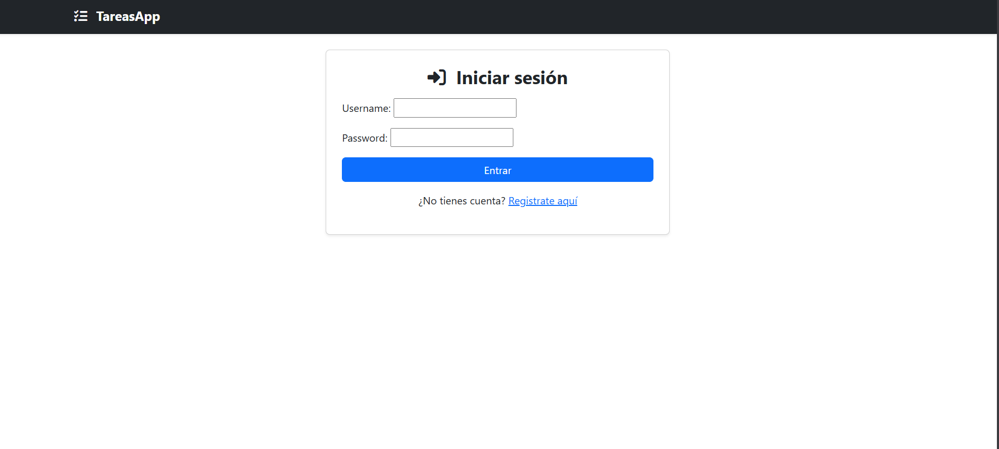
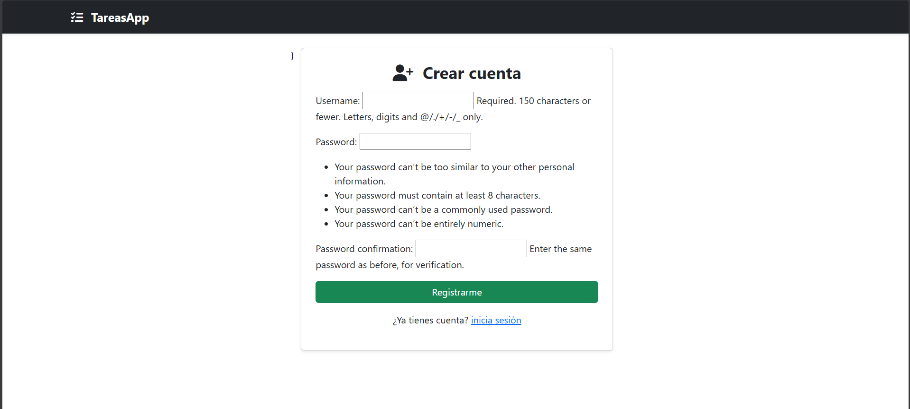

### Gestión de tareas

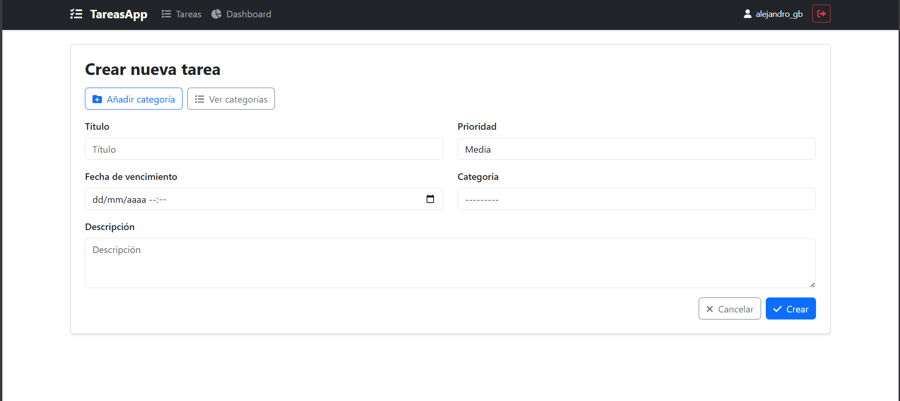
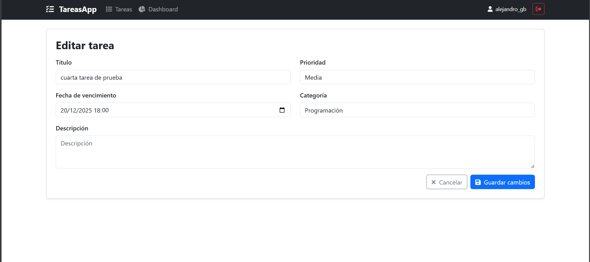
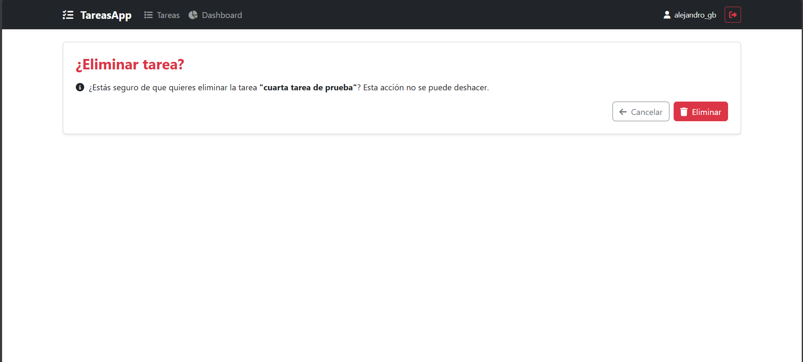
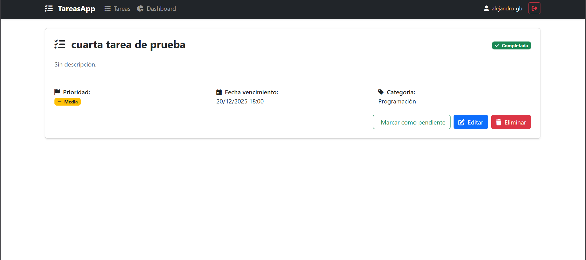

### Categorías
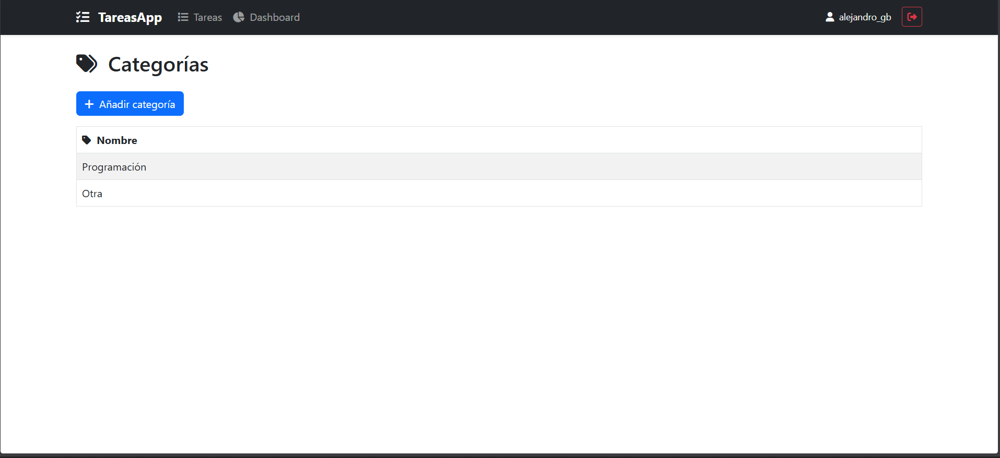
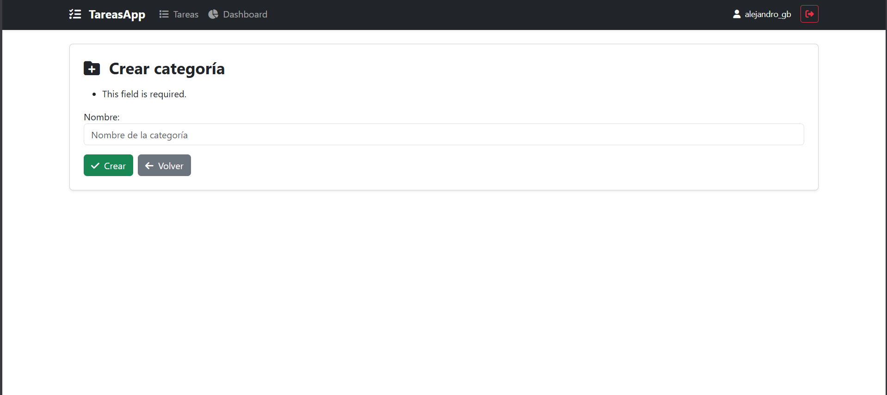

### Dashboard
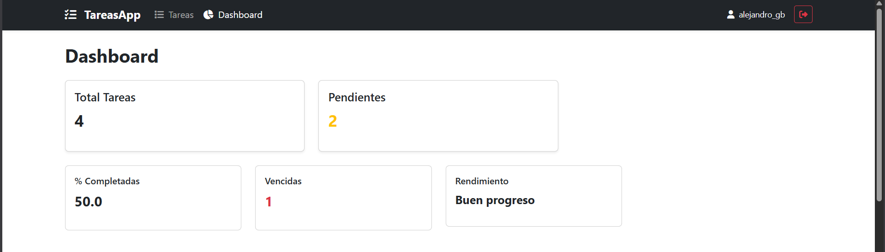
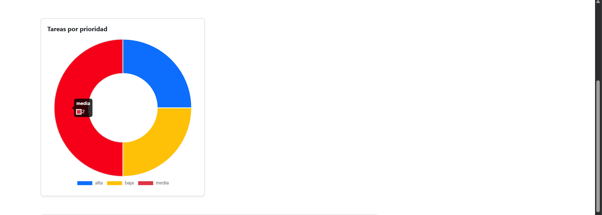
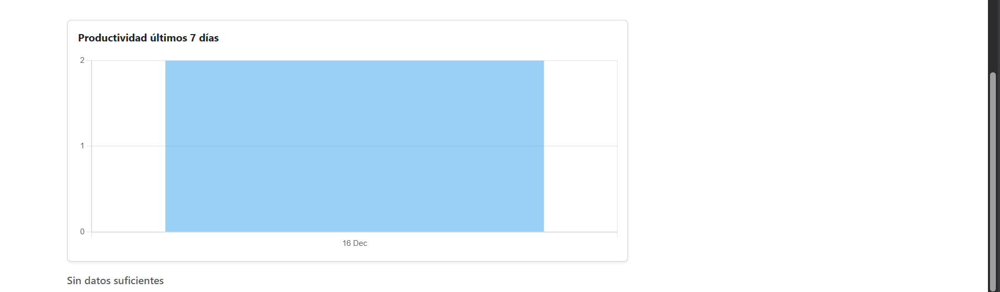

---

## 🎥 Video demo
📹 https://www.loom.com/share/3f4a3f41c8a74da296fb64dd0c11cb5c

---

## ⚙️ Funcionalidades principales
- Registro e inicio de sesión de usuarios
- CRUD completo de tareas
- Gestión de categorías personalizadas
- Panel de control con métricas visuales
- Validaciones y mensajes de confirmación
- Autorización por usuario (aislamiento total de datos)

---

## 🛠️ Tecnologías utilizadas
- **Python 3.14**
- **Django** – backend y lógica del sistema
- **HTML5 / CSS3**
- **Bootstrap** – diseño responsive
- **PostgreSQL** – base de datos en producción
- **Git & GitHub** – control de versiones
- **Render** – despliegue en producción

---

## 🧠 Explicación técnica

El proyecto sigue la arquitectura estándar de Django, con una clara separación de responsabilidades.

Las vistas generales se manejan en `views.py`, mientras que el dashboard cuenta con un archivo dedicado (`views_dashboard.py`) para mejorar la mantenibilidad y escalabilidad del código.

Se utiliza el sistema de autenticación nativo de Django, relacionando tareas y categorías con el usuario autenticado mediante claves foráneas, garantizando que cada usuario solo pueda acceder a sus propios datos.

El despliegue se realizó en Render utilizando PostgreSQL como base de datos en producción y Gunicorn como servidor WSGI.

---

## 📦 Instalación local

```bash
git clone https://github.com/tu_usuario/gestor_tareas.git
cd gestor_tareas
python -m venv venv
source venv/bin/activate  # Windows: venv\Scripts\activate
pip install -r requirements.txt
python manage.py migrate
python manage.py runserver

---

## 👤 Autor

Alejandro Gómez Berrio
Estudiante | Backend Developer Jr
Interesado en desarrollo web, arquitectura de software y sistemas escalables.